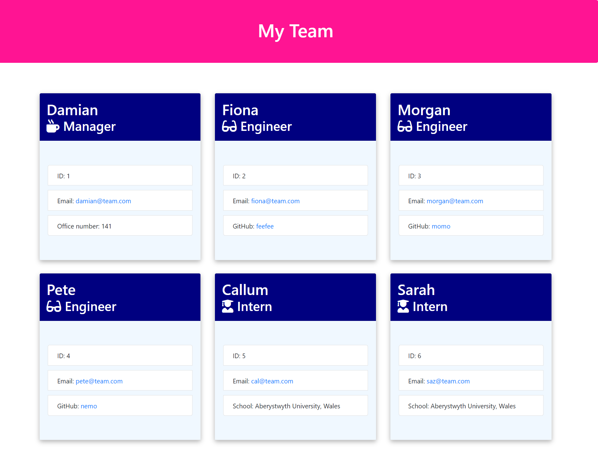
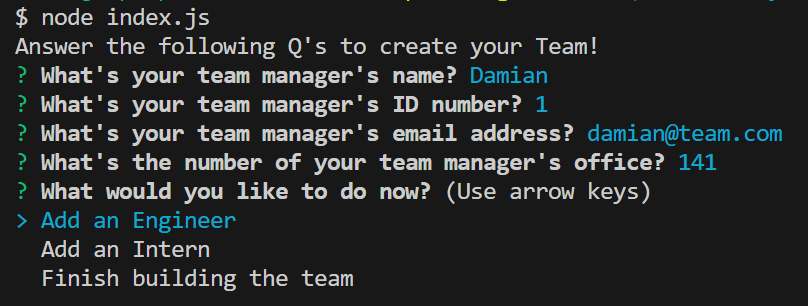
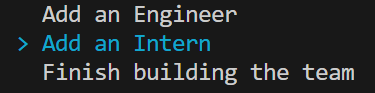
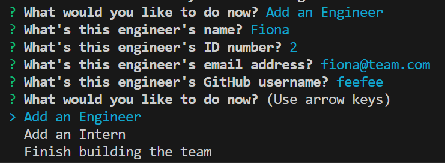
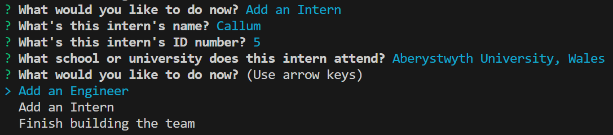
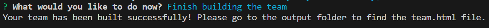

# Team Generator 
* A sample html file generated by this application can be found in the sample folder , titled "sample-team.html".
* The sample html file is also available in the sample repo which can be found here: https://github.com/shemlock/sample-team-html
* The link to the deployed application for the sample html file is available here: https://shemlock.github.io/sample-team-html/

The screenshot below is an example of a team webpage created with a html file that was generated using the Team Generator Application.

 

## Description

Team generator is a Node.js command-line application that takes in information about employees on a software engineering team, then generates a HTML webpage that displays summaries for each person. Information can be added for one manager, and as many engineers and interns as you like. 

The motivation for this project was to allow users to consolidate team information into a easily accessible webpage that displays their team's information, so that it is quick and easy to access details such as their email address or GitHub profile.

This project solves the problem of having team member information scattered everywhere. It streamlines the process of generating the html file and team webpage. Users can then easily find out basic information about their team members, in an accessible and intuitive way. 

  Building this project helped me learn about
  * Node.js
  * Inquirer
  * Jest
  * Unit Testing
  * Object Oriented Programming

## Table of Contents

- [Installation](#installation)
- [Usage](#usage)
- [License](#license)
- [Badges](#badges)
- [Features](#features)
- [Tests](#features)

## Installation

* Clone this repo.
* Then run "npm install" in the terminal of this repo's directory.

## Usage
* To start the application run "node index.js" in the terminal.

* Then in you will see the prompts illustrated in the image below. The prompts are in white, example answers are in blue. Please type in your own answers relevant to your manager.
  
 

* When you have finished entering your manager information, you will see the menu shown in the image below. Please use the arrow keys to select what you would like to do next.
  
  

* If you select "Add an engineer", you will then see engineer related prompts as shown in the image below.
  
    
  
* Once you have finished entering your engineer infomration, the "What would you like to do now?" menu will reappear. You can add as many engineers as you like.
  
* If you select "Add an Intern", you will then see intern related prompts as shown in the image below.
  
   
  
* Once you have finished entering your intern infomration, the "What would you like to do now?" menu will reappear. You can add as many interns as you like.
  
* If you select "Finish building the team", your html file will now be generated and you should see this message in the terminal.
  
 

* Please then check the output folder to view your html file. You can right-click the html file and select "Open with Live Server" to view your teams webpage!

## License

MIT

## Badges

## Features

* Accepts user input
* Generates a html file
* Shows the following basic information for team members:
* Name
* Role + Icon
* Employee ID Number
* Email Address
* Office Number (For Manager)
* GitHub profile (For Engineers)
* School/University (For Interns) 

## Tests

Tests were written using Jest,  test.js files for each class (Manager, Engineer, Intern, Employee) can be found in the _tests_ folder. To run tests, please run "npm test" in the terminal.
